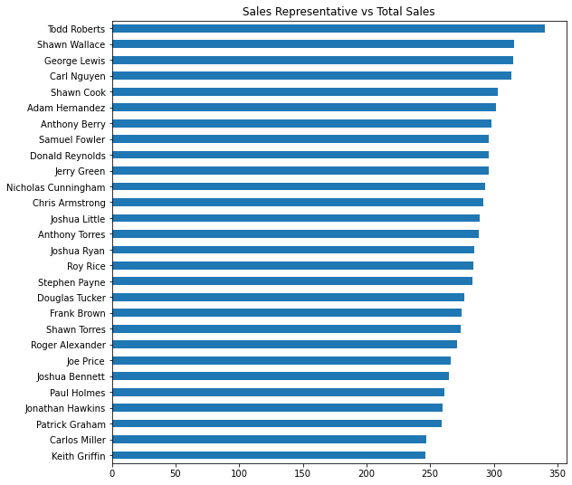
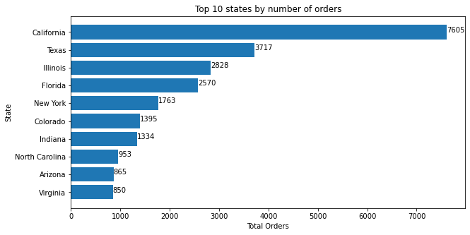
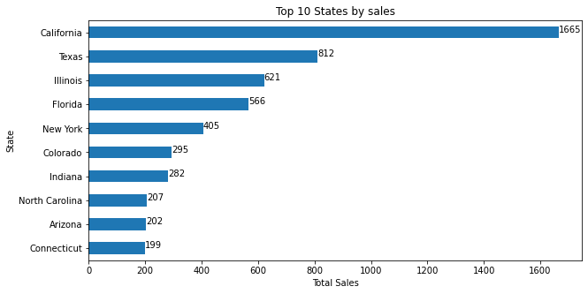
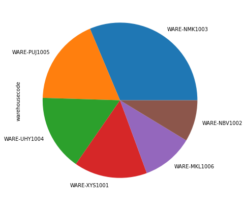
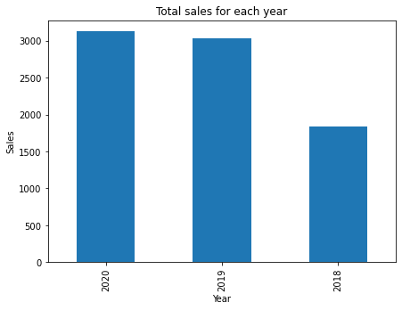
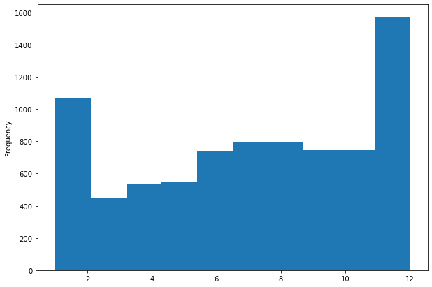

```python
import pandas as pd
import matplotlib.pyplot as plt
import numpy as np
from datetime import datetime
```


```python
pd.options.display.max_columns = None
pd.options.display.max_rows = None
```


```python
sales_order_sheet = pd.read_excel('US_Regional_Sales_Data.xlsx', sheet_name='Sales Orders Sheet')
customers_sheet = pd.read_excel('US_Regional_Sales_Data.xlsx', sheet_name='Customers Sheet')
store_location_sheet = pd.read_excel('US_Regional_Sales_Data.xlsx', sheet_name='Store Locations Sheet')
products_sheet = pd.read_excel('US_Regional_Sales_Data.xlsx', sheet_name='Products Sheet')
regions_sheet = pd.read_excel('US_Regional_Sales_Data.xlsx', sheet_name='Regions Sheet')
sales_team_sheet = pd.read_excel('US_Regional_Sales_Data.xlsx', sheet_name='Sales Team Sheet')
```


```python
sales_order_sheet.head()
```


<div>
<style scoped>
    .dataframe tbody tr th:only-of-type {
        vertical-align: middle;
    }

    .dataframe tbody tr th {
        vertical-align: top;
    }

    .dataframe thead th {
        text-align: right;
    }
</style>
<table border="1" class="dataframe">
  <thead>
    <tr style="text-align: right;">
      <th></th>
      <th>OrderNumber</th>
      <th>Sales Channel</th>
      <th>WarehouseCode</th>
      <th>ProcuredDate</th>
      <th>OrderDate</th>
      <th>ShipDate</th>
      <th>DeliveryDate</th>
      <th>CurrencyCode</th>
      <th>_SalesTeamID</th>
      <th>_CustomerID</th>
      <th>_StoreID</th>
      <th>_ProductID</th>
      <th>Order Quantity</th>
      <th>Discount Applied</th>
      <th>Unit Price</th>
      <th>Unit Cost</th>
    </tr>
  </thead>
  <tbody>
    <tr>
      <th>0</th>
      <td>SO - 000101</td>
      <td>In-Store</td>
      <td>WARE-UHY1004</td>
      <td>2017-12-31</td>
      <td>2018-05-31</td>
      <td>2018-06-14</td>
      <td>2018-06-19</td>
      <td>USD</td>
      <td>6</td>
      <td>15</td>
      <td>259</td>
      <td>12</td>
      <td>5</td>
      <td>0.075</td>
      <td>1963.1</td>
      <td>1001.181</td>
    </tr>
    <tr>
      <th>1</th>
      <td>SO - 000102</td>
      <td>Online</td>
      <td>WARE-NMK1003</td>
      <td>2017-12-31</td>
      <td>2018-05-31</td>
      <td>2018-06-22</td>
      <td>2018-07-02</td>
      <td>USD</td>
      <td>14</td>
      <td>20</td>
      <td>196</td>
      <td>27</td>
      <td>3</td>
      <td>0.075</td>
      <td>3939.6</td>
      <td>3348.660</td>
    </tr>
    <tr>
      <th>2</th>
      <td>SO - 000103</td>
      <td>Distributor</td>
      <td>WARE-UHY1004</td>
      <td>2017-12-31</td>
      <td>2018-05-31</td>
      <td>2018-06-21</td>
      <td>2018-07-01</td>
      <td>USD</td>
      <td>21</td>
      <td>16</td>
      <td>213</td>
      <td>16</td>
      <td>1</td>
      <td>0.050</td>
      <td>1775.5</td>
      <td>781.220</td>
    </tr>
    <tr>
      <th>3</th>
      <td>SO - 000104</td>
      <td>Wholesale</td>
      <td>WARE-NMK1003</td>
      <td>2017-12-31</td>
      <td>2018-05-31</td>
      <td>2018-06-02</td>
      <td>2018-06-07</td>
      <td>USD</td>
      <td>28</td>
      <td>48</td>
      <td>107</td>
      <td>23</td>
      <td>8</td>
      <td>0.075</td>
      <td>2324.9</td>
      <td>1464.687</td>
    </tr>
    <tr>
      <th>4</th>
      <td>SO - 000105</td>
      <td>Distributor</td>
      <td>WARE-NMK1003</td>
      <td>2018-04-10</td>
      <td>2018-05-31</td>
      <td>2018-06-16</td>
      <td>2018-06-26</td>
      <td>USD</td>
      <td>22</td>
      <td>49</td>
      <td>111</td>
      <td>26</td>
      <td>8</td>
      <td>0.100</td>
      <td>1822.4</td>
      <td>1476.144</td>
    </tr>
  </tbody>
</table>
</div>


```python
sales_team_sheet.head()
```


<div>
<style scoped>
    .dataframe tbody tr th:only-of-type {
        vertical-align: middle;
    }

    .dataframe tbody tr th {
        vertical-align: top;
    }

    .dataframe thead th {
        text-align: right;
    }
</style>
<table border="1" class="dataframe">
  <thead>
    <tr style="text-align: right;">
      <th></th>
      <th>_SalesTeamID</th>
      <th>Sales Team</th>
      <th>Region</th>
    </tr>
  </thead>
  <tbody>
    <tr>
      <th>0</th>
      <td>1</td>
      <td>Adam Hernandez</td>
      <td>Northeast</td>
    </tr>
    <tr>
      <th>1</th>
      <td>2</td>
      <td>Keith Griffin</td>
      <td>Northeast</td>
    </tr>
    <tr>
      <th>2</th>
      <td>3</td>
      <td>Jerry Green</td>
      <td>West</td>
    </tr>
    <tr>
      <th>3</th>
      <td>4</td>
      <td>Chris Armstrong</td>
      <td>Northeast</td>
    </tr>
    <tr>
      <th>4</th>
      <td>5</td>
      <td>Stephen Payne</td>
      <td>South</td>
    </tr>
  </tbody>
</table>
</div>


```python
customers_sheet.head()
```


<div>
<style scoped>
    .dataframe tbody tr th:only-of-type {
        vertical-align: middle;
    }

    .dataframe tbody tr th {
        vertical-align: top;
    }

    .dataframe thead th {
        text-align: right;
    }
</style>
<table border="1" class="dataframe">
  <thead>
    <tr style="text-align: right;">
      <th></th>
      <th>_CustomerID</th>
      <th>Customer Names</th>
    </tr>
  </thead>
  <tbody>
    <tr>
      <th>0</th>
      <td>1</td>
      <td>Avon Corp</td>
    </tr>
    <tr>
      <th>1</th>
      <td>2</td>
      <td>WakeFern</td>
    </tr>
    <tr>
      <th>2</th>
      <td>3</td>
      <td>Elorac, Corp</td>
    </tr>
    <tr>
      <th>3</th>
      <td>4</td>
      <td>ETUDE Ltd</td>
    </tr>
    <tr>
      <th>4</th>
      <td>5</td>
      <td>Procter Corp</td>
    </tr>
  </tbody>
</table>
</div>


```python
store_location_sheet.head()
```


<div>
<style scoped>
    .dataframe tbody tr th:only-of-type {
        vertical-align: middle;
    }

    .dataframe tbody tr th {
        vertical-align: top;
    }

    .dataframe thead th {
        text-align: right;
    }
</style>
<table border="1" class="dataframe">
  <thead>
    <tr style="text-align: right;">
      <th></th>
      <th>_StoreID</th>
      <th>City Name</th>
      <th>County</th>
      <th>StateCode</th>
      <th>State</th>
      <th>Type</th>
      <th>Latitude</th>
      <th>Longitude</th>
      <th>AreaCode</th>
      <th>Population</th>
      <th>Household Income</th>
      <th>Median Income</th>
      <th>Land Area</th>
      <th>Water Area</th>
      <th>Time Zone</th>
    </tr>
  </thead>
  <tbody>
    <tr>
      <th>0</th>
      <td>1</td>
      <td>Birmingham</td>
      <td>Shelby County/Jefferson County</td>
      <td>AL</td>
      <td>Alabama</td>
      <td>City</td>
      <td>33.52744</td>
      <td>-86.79905</td>
      <td>205</td>
      <td>212461</td>
      <td>89972</td>
      <td>31061</td>
      <td>378353942</td>
      <td>6591013</td>
      <td>America/Chicago</td>
    </tr>
    <tr>
      <th>1</th>
      <td>2</td>
      <td>Huntsville</td>
      <td>Limestone County/Madison County</td>
      <td>AL</td>
      <td>Alabama</td>
      <td>City</td>
      <td>34.69901</td>
      <td>-86.67298</td>
      <td>256</td>
      <td>190582</td>
      <td>78554</td>
      <td>48775</td>
      <td>552604579</td>
      <td>3452021</td>
      <td>America/Chicago</td>
    </tr>
    <tr>
      <th>2</th>
      <td>3</td>
      <td>Mobile</td>
      <td>Mobile County</td>
      <td>AL</td>
      <td>Alabama</td>
      <td>City</td>
      <td>30.69436</td>
      <td>-88.04305</td>
      <td>251</td>
      <td>194288</td>
      <td>76170</td>
      <td>38776</td>
      <td>361044263</td>
      <td>105325210</td>
      <td>America/Chicago</td>
    </tr>
    <tr>
      <th>3</th>
      <td>4</td>
      <td>Montgomery</td>
      <td>Montgomery County</td>
      <td>AL</td>
      <td>Alabama</td>
      <td>City</td>
      <td>32.36681</td>
      <td>-86.29997</td>
      <td>334</td>
      <td>200602</td>
      <td>79866</td>
      <td>42927</td>
      <td>413985435</td>
      <td>4411954</td>
      <td>America/Chicago</td>
    </tr>
    <tr>
      <th>4</th>
      <td>5</td>
      <td>Little Rock</td>
      <td>Pulaski County</td>
      <td>AR</td>
      <td>Arkansas</td>
      <td>City</td>
      <td>34.74648</td>
      <td>-92.28959</td>
      <td>501</td>
      <td>197992</td>
      <td>79902</td>
      <td>46085</td>
      <td>307398785</td>
      <td>6758644</td>
      <td>America/Chicago</td>
    </tr>
  </tbody>
</table>
</div>


```python
products_sheet.head()
```


<div>
<style scoped>
    .dataframe tbody tr th:only-of-type {
        vertical-align: middle;
    }

    .dataframe tbody tr th {
        vertical-align: top;
    }

    .dataframe thead th {
        text-align: right;
    }
</style>
<table border="1" class="dataframe">
  <thead>
    <tr style="text-align: right;">
      <th></th>
      <th>_ProductID</th>
      <th>Product Name</th>
    </tr>
  </thead>
  <tbody>
    <tr>
      <th>0</th>
      <td>1</td>
      <td>Cookware</td>
    </tr>
    <tr>
      <th>1</th>
      <td>2</td>
      <td>Photo Frames</td>
    </tr>
    <tr>
      <th>2</th>
      <td>3</td>
      <td>Table Lamps</td>
    </tr>
    <tr>
      <th>3</th>
      <td>4</td>
      <td>Serveware</td>
    </tr>
    <tr>
      <th>4</th>
      <td>5</td>
      <td>Bathroom Furniture</td>
    </tr>
  </tbody>
</table>
</div>


```python
regions_sheet.head()
```


<div>
<style scoped>
    .dataframe tbody tr th:only-of-type {
        vertical-align: middle;
    }

    .dataframe tbody tr th {
        vertical-align: top;
    }

    .dataframe thead th {
        text-align: right;
    }
</style>
<table border="1" class="dataframe">
  <thead>
    <tr style="text-align: right;">
      <th></th>
      <th>StateCode</th>
      <th>State</th>
      <th>Region</th>
    </tr>
  </thead>
  <tbody>
    <tr>
      <th>0</th>
      <td>AL</td>
      <td>Alabama</td>
      <td>South</td>
    </tr>
    <tr>
      <th>1</th>
      <td>AR</td>
      <td>Arkansas</td>
      <td>South</td>
    </tr>
    <tr>
      <th>2</th>
      <td>AZ</td>
      <td>Arizona</td>
      <td>West</td>
    </tr>
    <tr>
      <th>3</th>
      <td>CA</td>
      <td>California</td>
      <td>West</td>
    </tr>
    <tr>
      <th>4</th>
      <td>CO</td>
      <td>Colorado</td>
      <td>West</td>
    </tr>
  </tbody>
</table>
</div>


```python
sales_team_sheet.head()
```


<div>
<style scoped>
    .dataframe tbody tr th:only-of-type {
        vertical-align: middle;
    }

    .dataframe tbody tr th {
        vertical-align: top;
    }

    .dataframe thead th {
        text-align: right;
    }
</style>
<table border="1" class="dataframe">
  <thead>
    <tr style="text-align: right;">
      <th></th>
      <th>_SalesTeamID</th>
      <th>Sales Team</th>
      <th>Region</th>
    </tr>
  </thead>
  <tbody>
    <tr>
      <th>0</th>
      <td>1</td>
      <td>Adam Hernandez</td>
      <td>Northeast</td>
    </tr>
    <tr>
      <th>1</th>
      <td>2</td>
      <td>Keith Griffin</td>
      <td>Northeast</td>
    </tr>
    <tr>
      <th>2</th>
      <td>3</td>
      <td>Jerry Green</td>
      <td>West</td>
    </tr>
    <tr>
      <th>3</th>
      <td>4</td>
      <td>Chris Armstrong</td>
      <td>Northeast</td>
    </tr>
    <tr>
      <th>4</th>
      <td>5</td>
      <td>Stephen Payne</td>
      <td>South</td>
    </tr>
  </tbody>
</table>
</div>


# *Merging and preparing data for analysis*


```python
dataframes = [sales_order_sheet, customers_sheet, store_location_sheet, products_sheet, regions_sheet,
              sales_team_sheet]

for name in dataframes:
    name.columns = name.columns.str.lower()
    name.columns = name.columns.str.replace('_', '')
```

### Merging Sales Order Sheet and Customer sheet


```python
df1 = pd.merge(sales_order_sheet, customers_sheet, on='customerid')
df1.drop(columns={'customerid'}, inplace=True)
```


```python
df1.head()
```


<div>
<style scoped>
    .dataframe tbody tr th:only-of-type {
        vertical-align: middle;
    }

    .dataframe tbody tr th {
        vertical-align: top;
    }

    .dataframe thead th {
        text-align: right;
    }
</style>
<table border="1" class="dataframe">
  <thead>
    <tr style="text-align: right;">
      <th></th>
      <th>ordernumber</th>
      <th>sales channel</th>
      <th>warehousecode</th>
      <th>procureddate</th>
      <th>orderdate</th>
      <th>shipdate</th>
      <th>deliverydate</th>
      <th>currencycode</th>
      <th>salesteamid</th>
      <th>storeid</th>
      <th>productid</th>
      <th>order quantity</th>
      <th>discount applied</th>
      <th>unit price</th>
      <th>unit cost</th>
      <th>customer names</th>
    </tr>
  </thead>
  <tbody>
    <tr>
      <th>0</th>
      <td>SO - 000101</td>
      <td>In-Store</td>
      <td>WARE-UHY1004</td>
      <td>2017-12-31</td>
      <td>2018-05-31</td>
      <td>2018-06-14</td>
      <td>2018-06-19</td>
      <td>USD</td>
      <td>6</td>
      <td>259</td>
      <td>12</td>
      <td>5</td>
      <td>0.075</td>
      <td>1963.1</td>
      <td>1001.181</td>
      <td>Rochester Ltd</td>
    </tr>
    <tr>
      <th>1</th>
      <td>SO - 000125</td>
      <td>In-Store</td>
      <td>WARE-NMK1003</td>
      <td>2018-04-10</td>
      <td>2018-06-02</td>
      <td>2018-06-16</td>
      <td>2018-06-24</td>
      <td>USD</td>
      <td>4</td>
      <td>173</td>
      <td>13</td>
      <td>1</td>
      <td>0.150</td>
      <td>268.0</td>
      <td>131.320</td>
      <td>Rochester Ltd</td>
    </tr>
    <tr>
      <th>2</th>
      <td>SO - 000212</td>
      <td>In-Store</td>
      <td>WARE-NMK1003</td>
      <td>2017-12-31</td>
      <td>2018-06-13</td>
      <td>2018-07-05</td>
      <td>2018-07-13</td>
      <td>USD</td>
      <td>7</td>
      <td>144</td>
      <td>8</td>
      <td>3</td>
      <td>0.100</td>
      <td>2217.7</td>
      <td>1707.629</td>
      <td>Rochester Ltd</td>
    </tr>
    <tr>
      <th>3</th>
      <td>SO - 000268</td>
      <td>In-Store</td>
      <td>WARE-NMK1003</td>
      <td>2018-04-10</td>
      <td>2018-06-19</td>
      <td>2018-07-14</td>
      <td>2018-07-17</td>
      <td>USD</td>
      <td>3</td>
      <td>178</td>
      <td>2</td>
      <td>5</td>
      <td>0.075</td>
      <td>1293.1</td>
      <td>659.481</td>
      <td>Rochester Ltd</td>
    </tr>
    <tr>
      <th>4</th>
      <td>SO - 000334</td>
      <td>In-Store</td>
      <td>WARE-MKL1006</td>
      <td>2018-04-10</td>
      <td>2018-06-28</td>
      <td>2018-07-10</td>
      <td>2018-07-17</td>
      <td>USD</td>
      <td>10</td>
      <td>352</td>
      <td>18</td>
      <td>2</td>
      <td>0.150</td>
      <td>2586.2</td>
      <td>1629.306</td>
      <td>Rochester Ltd</td>
    </tr>
  </tbody>
</table>
</div>


```python

```

### Merging df1 (sales order sheet + customer sheet) and store location sheet


```python
df2 = pd.merge(df1, store_location_sheet, on='storeid')
df2.drop(columns={'storeid'}, inplace=True)
```


```python
df2.head()
```


<div>
<style scoped>
    .dataframe tbody tr th:only-of-type {
        vertical-align: middle;
    }

    .dataframe tbody tr th {
        vertical-align: top;
    }

    .dataframe thead th {
        text-align: right;
    }
</style>
<table border="1" class="dataframe">
  <thead>
    <tr style="text-align: right;">
      <th></th>
      <th>ordernumber</th>
      <th>sales channel</th>
      <th>warehousecode</th>
      <th>procureddate</th>
      <th>orderdate</th>
      <th>shipdate</th>
      <th>deliverydate</th>
      <th>currencycode</th>
      <th>salesteamid</th>
      <th>productid</th>
      <th>order quantity</th>
      <th>discount applied</th>
      <th>unit price</th>
      <th>unit cost</th>
      <th>customer names</th>
      <th>city name</th>
      <th>county</th>
      <th>statecode</th>
      <th>state</th>
      <th>type</th>
      <th>latitude</th>
      <th>longitude</th>
      <th>areacode</th>
      <th>population</th>
      <th>household income</th>
      <th>median income</th>
      <th>land area</th>
      <th>water area</th>
      <th>time zone</th>
    </tr>
  </thead>
  <tbody>
    <tr>
      <th>0</th>
      <td>SO - 000101</td>
      <td>In-Store</td>
      <td>WARE-UHY1004</td>
      <td>2017-12-31</td>
      <td>2018-05-31</td>
      <td>2018-06-14</td>
      <td>2018-06-19</td>
      <td>USD</td>
      <td>6</td>
      <td>12</td>
      <td>5</td>
      <td>0.075</td>
      <td>1963.1</td>
      <td>1001.181</td>
      <td>Rochester Ltd</td>
      <td>Babylon (Town)</td>
      <td>Suffolk County</td>
      <td>NY</td>
      <td>New York</td>
      <td>Town</td>
      <td>40.64092</td>
      <td>-73.31669</td>
      <td>631</td>
      <td>213776</td>
      <td>68789</td>
      <td>80327</td>
      <td>135481314</td>
      <td>160302131</td>
      <td>America/New York</td>
    </tr>
    <tr>
      <th>1</th>
      <td>SO - 0003926</td>
      <td>Online</td>
      <td>WARE-UHY1004</td>
      <td>2019-05-15</td>
      <td>2019-08-24</td>
      <td>2019-09-13</td>
      <td>2019-09-21</td>
      <td>USD</td>
      <td>15</td>
      <td>9</td>
      <td>5</td>
      <td>0.050</td>
      <td>3993.2</td>
      <td>1836.872</td>
      <td>Pacific Ltd</td>
      <td>Babylon (Town)</td>
      <td>Suffolk County</td>
      <td>NY</td>
      <td>New York</td>
      <td>Town</td>
      <td>40.64092</td>
      <td>-73.31669</td>
      <td>631</td>
      <td>213776</td>
      <td>68789</td>
      <td>80327</td>
      <td>135481314</td>
      <td>160302131</td>
      <td>America/New York</td>
    </tr>
    <tr>
      <th>2</th>
      <td>SO - 0006713</td>
      <td>In-Store</td>
      <td>WARE-UHY1004</td>
      <td>2020-03-10</td>
      <td>2020-07-21</td>
      <td>2020-08-15</td>
      <td>2020-08-16</td>
      <td>USD</td>
      <td>6</td>
      <td>6</td>
      <td>3</td>
      <td>0.075</td>
      <td>2492.4</td>
      <td>1246.200</td>
      <td>Fenwal, Corp</td>
      <td>Babylon (Town)</td>
      <td>Suffolk County</td>
      <td>NY</td>
      <td>New York</td>
      <td>Town</td>
      <td>40.64092</td>
      <td>-73.31669</td>
      <td>631</td>
      <td>213776</td>
      <td>68789</td>
      <td>80327</td>
      <td>135481314</td>
      <td>160302131</td>
      <td>America/New York</td>
    </tr>
    <tr>
      <th>3</th>
      <td>SO - 0003168</td>
      <td>In-Store</td>
      <td>WARE-UHY1004</td>
      <td>2019-02-04</td>
      <td>2019-05-25</td>
      <td>2019-06-12</td>
      <td>2019-06-14</td>
      <td>USD</td>
      <td>4</td>
      <td>35</td>
      <td>3</td>
      <td>0.150</td>
      <td>6123.8</td>
      <td>2816.948</td>
      <td>Ohio</td>
      <td>Babylon (Town)</td>
      <td>Suffolk County</td>
      <td>NY</td>
      <td>New York</td>
      <td>Town</td>
      <td>40.64092</td>
      <td>-73.31669</td>
      <td>631</td>
      <td>213776</td>
      <td>68789</td>
      <td>80327</td>
      <td>135481314</td>
      <td>160302131</td>
      <td>America/New York</td>
    </tr>
    <tr>
      <th>4</th>
      <td>SO - 000236</td>
      <td>Distributor</td>
      <td>WARE-UHY1004</td>
      <td>2018-04-10</td>
      <td>2018-06-15</td>
      <td>2018-07-13</td>
      <td>2018-07-20</td>
      <td>USD</td>
      <td>21</td>
      <td>26</td>
      <td>1</td>
      <td>0.150</td>
      <td>3999.9</td>
      <td>2359.941</td>
      <td>Apollo Ltd</td>
      <td>Babylon (Town)</td>
      <td>Suffolk County</td>
      <td>NY</td>
      <td>New York</td>
      <td>Town</td>
      <td>40.64092</td>
      <td>-73.31669</td>
      <td>631</td>
      <td>213776</td>
      <td>68789</td>
      <td>80327</td>
      <td>135481314</td>
      <td>160302131</td>
      <td>America/New York</td>
    </tr>
  </tbody>
</table>
</div>


```python

```

### Merging df2 (sales order sheet + customer sheet + store location sheet) and sales team sheet


```python
df3 = pd.merge(df2, sales_team_sheet, on='salesteamid')
df3.drop(columns={'salesteamid'}, inplace=True)
```


```python
df3.head()
```


<div>
<style scoped>
    .dataframe tbody tr th:only-of-type {
        vertical-align: middle;
    }

    .dataframe tbody tr th {
        vertical-align: top;
    }

    .dataframe thead th {
        text-align: right;
    }
</style>
<table border="1" class="dataframe">
  <thead>
    <tr style="text-align: right;">
      <th></th>
      <th>ordernumber</th>
      <th>sales channel</th>
      <th>warehousecode</th>
      <th>procureddate</th>
      <th>orderdate</th>
      <th>shipdate</th>
      <th>deliverydate</th>
      <th>currencycode</th>
      <th>productid</th>
      <th>order quantity</th>
      <th>discount applied</th>
      <th>unit price</th>
      <th>unit cost</th>
      <th>customer names</th>
      <th>city name</th>
      <th>county</th>
      <th>statecode</th>
      <th>state</th>
      <th>type</th>
      <th>latitude</th>
      <th>longitude</th>
      <th>areacode</th>
      <th>population</th>
      <th>household income</th>
      <th>median income</th>
      <th>land area</th>
      <th>water area</th>
      <th>time zone</th>
      <th>sales team</th>
      <th>region</th>
    </tr>
  </thead>
  <tbody>
    <tr>
      <th>0</th>
      <td>SO - 000101</td>
      <td>In-Store</td>
      <td>WARE-UHY1004</td>
      <td>2017-12-31</td>
      <td>2018-05-31</td>
      <td>2018-06-14</td>
      <td>2018-06-19</td>
      <td>USD</td>
      <td>12</td>
      <td>5</td>
      <td>0.075</td>
      <td>1963.1</td>
      <td>1001.181</td>
      <td>Rochester Ltd</td>
      <td>Babylon (Town)</td>
      <td>Suffolk County</td>
      <td>NY</td>
      <td>New York</td>
      <td>Town</td>
      <td>40.64092</td>
      <td>-73.31669</td>
      <td>631</td>
      <td>213776</td>
      <td>68789</td>
      <td>80327</td>
      <td>135481314</td>
      <td>160302131</td>
      <td>America/New York</td>
      <td>Joshua Bennett</td>
      <td>Northeast</td>
    </tr>
    <tr>
      <th>1</th>
      <td>SO - 0006713</td>
      <td>In-Store</td>
      <td>WARE-UHY1004</td>
      <td>2020-03-10</td>
      <td>2020-07-21</td>
      <td>2020-08-15</td>
      <td>2020-08-16</td>
      <td>USD</td>
      <td>6</td>
      <td>3</td>
      <td>0.075</td>
      <td>2492.4</td>
      <td>1246.200</td>
      <td>Fenwal, Corp</td>
      <td>Babylon (Town)</td>
      <td>Suffolk County</td>
      <td>NY</td>
      <td>New York</td>
      <td>Town</td>
      <td>40.64092</td>
      <td>-73.31669</td>
      <td>631</td>
      <td>213776</td>
      <td>68789</td>
      <td>80327</td>
      <td>135481314</td>
      <td>160302131</td>
      <td>America/New York</td>
      <td>Joshua Bennett</td>
      <td>Northeast</td>
    </tr>
    <tr>
      <th>2</th>
      <td>SO - 0005035</td>
      <td>In-Store</td>
      <td>WARE-UHY1004</td>
      <td>2019-08-23</td>
      <td>2020-01-08</td>
      <td>2020-01-15</td>
      <td>2020-01-21</td>
      <td>USD</td>
      <td>1</td>
      <td>3</td>
      <td>0.150</td>
      <td>1755.4</td>
      <td>1298.996</td>
      <td>Niconovum Corp</td>
      <td>Babylon (Town)</td>
      <td>Suffolk County</td>
      <td>NY</td>
      <td>New York</td>
      <td>Town</td>
      <td>40.64092</td>
      <td>-73.31669</td>
      <td>631</td>
      <td>213776</td>
      <td>68789</td>
      <td>80327</td>
      <td>135481314</td>
      <td>160302131</td>
      <td>America/New York</td>
      <td>Joshua Bennett</td>
      <td>Northeast</td>
    </tr>
    <tr>
      <th>3</th>
      <td>SO - 0006409</td>
      <td>In-Store</td>
      <td>WARE-UHY1004</td>
      <td>2020-03-10</td>
      <td>2020-06-17</td>
      <td>2020-07-03</td>
      <td>2020-07-12</td>
      <td>USD</td>
      <td>16</td>
      <td>5</td>
      <td>0.075</td>
      <td>3544.3</td>
      <td>2020.251</td>
      <td>Weimei Corp</td>
      <td>Babylon (Town)</td>
      <td>Suffolk County</td>
      <td>NY</td>
      <td>New York</td>
      <td>Town</td>
      <td>40.64092</td>
      <td>-73.31669</td>
      <td>631</td>
      <td>213776</td>
      <td>68789</td>
      <td>80327</td>
      <td>135481314</td>
      <td>160302131</td>
      <td>America/New York</td>
      <td>Joshua Bennett</td>
      <td>Northeast</td>
    </tr>
    <tr>
      <th>4</th>
      <td>SO - 0001765</td>
      <td>In-Store</td>
      <td>WARE-NMK1003</td>
      <td>2018-07-19</td>
      <td>2018-12-15</td>
      <td>2018-12-27</td>
      <td>2018-12-29</td>
      <td>USD</td>
      <td>19</td>
      <td>5</td>
      <td>0.050</td>
      <td>1139.0</td>
      <td>899.810</td>
      <td>Elorac, Corp</td>
      <td>Rockford</td>
      <td>Winnebago County/Ogle County</td>
      <td>IL</td>
      <td>Illinois</td>
      <td>City</td>
      <td>42.25884</td>
      <td>-89.06455</td>
      <td>815</td>
      <td>148278</td>
      <td>58559</td>
      <td>38716</td>
      <td>164382960</td>
      <td>2627885</td>
      <td>America/Chicago</td>
      <td>Joshua Bennett</td>
      <td>Northeast</td>
    </tr>
  </tbody>
</table>
</div>


### Merging df3 (sales order sheet + customer sheet + store location sheet + sales team sheet) and products sheet


```python
df4 = pd.merge(df3, products_sheet, on='productid')
df4.drop(columns={'productid'}, inplace=True)
```


```python
df4.head()
```


<div>
<style scoped>
    .dataframe tbody tr th:only-of-type {
        vertical-align: middle;
    }

    .dataframe tbody tr th {
        vertical-align: top;
    }

    .dataframe thead th {
        text-align: right;
    }
</style>
<table border="1" class="dataframe">
  <thead>
    <tr style="text-align: right;">
      <th></th>
      <th>ordernumber</th>
      <th>sales channel</th>
      <th>warehousecode</th>
      <th>procureddate</th>
      <th>orderdate</th>
      <th>shipdate</th>
      <th>deliverydate</th>
      <th>currencycode</th>
      <th>order quantity</th>
      <th>discount applied</th>
      <th>unit price</th>
      <th>unit cost</th>
      <th>customer names</th>
      <th>city name</th>
      <th>county</th>
      <th>statecode</th>
      <th>state</th>
      <th>type</th>
      <th>latitude</th>
      <th>longitude</th>
      <th>areacode</th>
      <th>population</th>
      <th>household income</th>
      <th>median income</th>
      <th>land area</th>
      <th>water area</th>
      <th>time zone</th>
      <th>sales team</th>
      <th>region</th>
      <th>product name</th>
    </tr>
  </thead>
  <tbody>
    <tr>
      <th>0</th>
      <td>SO - 000101</td>
      <td>In-Store</td>
      <td>WARE-UHY1004</td>
      <td>2017-12-31</td>
      <td>2018-05-31</td>
      <td>2018-06-14</td>
      <td>2018-06-19</td>
      <td>USD</td>
      <td>5</td>
      <td>0.075</td>
      <td>1963.1</td>
      <td>1001.181</td>
      <td>Rochester Ltd</td>
      <td>Babylon (Town)</td>
      <td>Suffolk County</td>
      <td>NY</td>
      <td>New York</td>
      <td>Town</td>
      <td>40.64092</td>
      <td>-73.31669</td>
      <td>631</td>
      <td>213776</td>
      <td>68789</td>
      <td>80327</td>
      <td>135481314</td>
      <td>160302131</td>
      <td>America/New York</td>
      <td>Joshua Bennett</td>
      <td>Northeast</td>
      <td>Dining Furniture</td>
    </tr>
    <tr>
      <th>1</th>
      <td>SO - 0002491</td>
      <td>In-Store</td>
      <td>WARE-NMK1003</td>
      <td>2018-10-27</td>
      <td>2019-03-06</td>
      <td>2019-03-25</td>
      <td>2019-03-30</td>
      <td>USD</td>
      <td>7</td>
      <td>0.150</td>
      <td>1051.9</td>
      <td>610.102</td>
      <td>Apollo Ltd</td>
      <td>Macon</td>
      <td>Bibb County</td>
      <td>GA</td>
      <td>Georgia</td>
      <td>Other</td>
      <td>32.80884</td>
      <td>-83.69419</td>
      <td>478</td>
      <td>153515</td>
      <td>57025</td>
      <td>36568</td>
      <td>645603627</td>
      <td>14488557</td>
      <td>America/New York</td>
      <td>Joshua Bennett</td>
      <td>Northeast</td>
      <td>Dining Furniture</td>
    </tr>
    <tr>
      <th>2</th>
      <td>SO - 0001458</td>
      <td>In-Store</td>
      <td>WARE-NMK1003</td>
      <td>2018-07-19</td>
      <td>2018-11-09</td>
      <td>2018-11-11</td>
      <td>2018-11-17</td>
      <td>USD</td>
      <td>8</td>
      <td>0.300</td>
      <td>1011.7</td>
      <td>435.031</td>
      <td>Medline</td>
      <td>Colorado Springs</td>
      <td>El Paso County</td>
      <td>CO</td>
      <td>Colorado</td>
      <td>City</td>
      <td>38.83388</td>
      <td>-104.82136</td>
      <td>719</td>
      <td>456568</td>
      <td>174441</td>
      <td>54527</td>
      <td>506667557</td>
      <td>947196</td>
      <td>America/Denver</td>
      <td>Joshua Bennett</td>
      <td>Northeast</td>
      <td>Dining Furniture</td>
    </tr>
    <tr>
      <th>3</th>
      <td>SO - 0005166</td>
      <td>In-Store</td>
      <td>WARE-PUJ1005</td>
      <td>2019-08-23</td>
      <td>2020-01-22</td>
      <td>2020-01-28</td>
      <td>2020-01-31</td>
      <td>USD</td>
      <td>5</td>
      <td>0.050</td>
      <td>1909.5</td>
      <td>954.750</td>
      <td>New Ltd</td>
      <td>Buffalo</td>
      <td>Erie County</td>
      <td>NY</td>
      <td>New York</td>
      <td>City</td>
      <td>42.88645</td>
      <td>-78.87837</td>
      <td>716</td>
      <td>258071</td>
      <td>110549</td>
      <td>31918</td>
      <td>104592941</td>
      <td>31362925</td>
      <td>America/New York</td>
      <td>Joshua Bennett</td>
      <td>Northeast</td>
      <td>Dining Furniture</td>
    </tr>
    <tr>
      <th>4</th>
      <td>SO - 0002439</td>
      <td>In-Store</td>
      <td>WARE-UHY1004</td>
      <td>2018-10-27</td>
      <td>2019-02-26</td>
      <td>2019-03-06</td>
      <td>2019-03-10</td>
      <td>USD</td>
      <td>3</td>
      <td>0.200</td>
      <td>1775.5</td>
      <td>1047.545</td>
      <td>Trigen</td>
      <td>Paradise</td>
      <td>Clark County</td>
      <td>NV</td>
      <td>Nevada</td>
      <td>CDP</td>
      <td>36.09719</td>
      <td>-115.14666</td>
      <td>702</td>
      <td>223182</td>
      <td>88401</td>
      <td>43911</td>
      <td>121034884</td>
      <td>0</td>
      <td>America/Los Angeles</td>
      <td>Joshua Bennett</td>
      <td>Northeast</td>
      <td>Dining Furniture</td>
    </tr>
  </tbody>
</table>
</div>


```python

```


```python
df = df4.copy()
```


```python
df.head()
```


<div>
<style scoped>
    .dataframe tbody tr th:only-of-type {
        vertical-align: middle;
    }

    .dataframe tbody tr th {
        vertical-align: top;
    }

    .dataframe thead th {
        text-align: right;
    }
</style>
<table border="1" class="dataframe">
  <thead>
    <tr style="text-align: right;">
      <th></th>
      <th>ordernumber</th>
      <th>sales channel</th>
      <th>warehousecode</th>
      <th>procureddate</th>
      <th>orderdate</th>
      <th>shipdate</th>
      <th>deliverydate</th>
      <th>currencycode</th>
      <th>order quantity</th>
      <th>discount applied</th>
      <th>unit price</th>
      <th>unit cost</th>
      <th>customer names</th>
      <th>city name</th>
      <th>county</th>
      <th>statecode</th>
      <th>state</th>
      <th>type</th>
      <th>latitude</th>
      <th>longitude</th>
      <th>areacode</th>
      <th>population</th>
      <th>household income</th>
      <th>median income</th>
      <th>land area</th>
      <th>water area</th>
      <th>time zone</th>
      <th>sales team</th>
      <th>region</th>
      <th>product name</th>
    </tr>
  </thead>
  <tbody>
    <tr>
      <th>0</th>
      <td>SO - 000101</td>
      <td>In-Store</td>
      <td>WARE-UHY1004</td>
      <td>2017-12-31</td>
      <td>2018-05-31</td>
      <td>2018-06-14</td>
      <td>2018-06-19</td>
      <td>USD</td>
      <td>5</td>
      <td>0.075</td>
      <td>1963.1</td>
      <td>1001.181</td>
      <td>Rochester Ltd</td>
      <td>Babylon (Town)</td>
      <td>Suffolk County</td>
      <td>NY</td>
      <td>New York</td>
      <td>Town</td>
      <td>40.64092</td>
      <td>-73.31669</td>
      <td>631</td>
      <td>213776</td>
      <td>68789</td>
      <td>80327</td>
      <td>135481314</td>
      <td>160302131</td>
      <td>America/New York</td>
      <td>Joshua Bennett</td>
      <td>Northeast</td>
      <td>Dining Furniture</td>
    </tr>
    <tr>
      <th>1</th>
      <td>SO - 0002491</td>
      <td>In-Store</td>
      <td>WARE-NMK1003</td>
      <td>2018-10-27</td>
      <td>2019-03-06</td>
      <td>2019-03-25</td>
      <td>2019-03-30</td>
      <td>USD</td>
      <td>7</td>
      <td>0.150</td>
      <td>1051.9</td>
      <td>610.102</td>
      <td>Apollo Ltd</td>
      <td>Macon</td>
      <td>Bibb County</td>
      <td>GA</td>
      <td>Georgia</td>
      <td>Other</td>
      <td>32.80884</td>
      <td>-83.69419</td>
      <td>478</td>
      <td>153515</td>
      <td>57025</td>
      <td>36568</td>
      <td>645603627</td>
      <td>14488557</td>
      <td>America/New York</td>
      <td>Joshua Bennett</td>
      <td>Northeast</td>
      <td>Dining Furniture</td>
    </tr>
    <tr>
      <th>2</th>
      <td>SO - 0001458</td>
      <td>In-Store</td>
      <td>WARE-NMK1003</td>
      <td>2018-07-19</td>
      <td>2018-11-09</td>
      <td>2018-11-11</td>
      <td>2018-11-17</td>
      <td>USD</td>
      <td>8</td>
      <td>0.300</td>
      <td>1011.7</td>
      <td>435.031</td>
      <td>Medline</td>
      <td>Colorado Springs</td>
      <td>El Paso County</td>
      <td>CO</td>
      <td>Colorado</td>
      <td>City</td>
      <td>38.83388</td>
      <td>-104.82136</td>
      <td>719</td>
      <td>456568</td>
      <td>174441</td>
      <td>54527</td>
      <td>506667557</td>
      <td>947196</td>
      <td>America/Denver</td>
      <td>Joshua Bennett</td>
      <td>Northeast</td>
      <td>Dining Furniture</td>
    </tr>
    <tr>
      <th>3</th>
      <td>SO - 0005166</td>
      <td>In-Store</td>
      <td>WARE-PUJ1005</td>
      <td>2019-08-23</td>
      <td>2020-01-22</td>
      <td>2020-01-28</td>
      <td>2020-01-31</td>
      <td>USD</td>
      <td>5</td>
      <td>0.050</td>
      <td>1909.5</td>
      <td>954.750</td>
      <td>New Ltd</td>
      <td>Buffalo</td>
      <td>Erie County</td>
      <td>NY</td>
      <td>New York</td>
      <td>City</td>
      <td>42.88645</td>
      <td>-78.87837</td>
      <td>716</td>
      <td>258071</td>
      <td>110549</td>
      <td>31918</td>
      <td>104592941</td>
      <td>31362925</td>
      <td>America/New York</td>
      <td>Joshua Bennett</td>
      <td>Northeast</td>
      <td>Dining Furniture</td>
    </tr>
    <tr>
      <th>4</th>
      <td>SO - 0002439</td>
      <td>In-Store</td>
      <td>WARE-UHY1004</td>
      <td>2018-10-27</td>
      <td>2019-02-26</td>
      <td>2019-03-06</td>
      <td>2019-03-10</td>
      <td>USD</td>
      <td>3</td>
      <td>0.200</td>
      <td>1775.5</td>
      <td>1047.545</td>
      <td>Trigen</td>
      <td>Paradise</td>
      <td>Clark County</td>
      <td>NV</td>
      <td>Nevada</td>
      <td>CDP</td>
      <td>36.09719</td>
      <td>-115.14666</td>
      <td>702</td>
      <td>223182</td>
      <td>88401</td>
      <td>43911</td>
      <td>121034884</td>
      <td>0</td>
      <td>America/Los Angeles</td>
      <td>Joshua Bennett</td>
      <td>Northeast</td>
      <td>Dining Furniture</td>
    </tr>
  </tbody>
</table>
</div>


```python

```


```python

```

# Analysis


```python

```

## *Distribution of Sales for Sales Team representatives.*


```python
pd.unique(df['sales team'])
```


    array(['Joshua Bennett', 'Roger Alexander', 'Chris Armstrong',
           'Samuel Fowler', 'Carl Nguyen', 'Jonathan Hawkins',
           'Joshua Little', 'Keith Griffin', 'Roy Rice', 'Donald Reynolds',
           'Shawn Wallace', 'Nicholas Cunningham', 'Jerry Green',
           'Anthony Torres', 'Frank Brown', 'Todd Roberts', 'Adam Hernandez',
           'George Lewis', 'Douglas Tucker', 'Shawn Cook', 'Paul Holmes',
           'Carlos Miller', 'Anthony Berry', 'Shawn Torres', 'Patrick Graham',
           'Joshua Ryan', 'Stephen Payne', 'Joe Price'], dtype=object)


### There are 28 Sales Team representative in the dataset. Now I have to determine the total number of sales for each team leader.


```python
df['sales team'].value_counts().head(3)
```


    Todd Roberts     340
    Shawn Wallace    316
    George Lewis     315
    Name: sales team, dtype: int64


```python
df['sales team'].value_counts().tail(3)
```


    Patrick Graham    259
    Carlos Miller     247
    Keith Griffin     246
    Name: sales team, dtype: int64


```python
plt.title("Sales Representative vs Total Sales")
df['sales team'].value_counts().sort_values(ascending=True).plot.barh(figsize=(9,9))
```


    <AxesSubplot:title={'center':'Sales Representative vs Total Sales'}>


    

    


### Todd Roberts, with 340 total sales, Shawn Wallace, with 316 total sales, and George Lewis, with 315 total sales, have been the top sales representatives for the past three years, according to the data.
### Patrick Graham, with 259 total sales, Carlos Miller, with 247 total sales, and Keith Griffin, with 246 total sales, are the representatives with the lowest total sales.


```python

```


```python

```

## *Distribution of Orders and Sales for the top states*


```python
df.head(2)
```


<div>
<style scoped>
    .dataframe tbody tr th:only-of-type {
        vertical-align: middle;
    }

    .dataframe tbody tr th {
        vertical-align: top;
    }

    .dataframe thead th {
        text-align: right;
    }
</style>
<table border="1" class="dataframe">
  <thead>
    <tr style="text-align: right;">
      <th></th>
      <th>ordernumber</th>
      <th>sales channel</th>
      <th>warehousecode</th>
      <th>procureddate</th>
      <th>orderdate</th>
      <th>shipdate</th>
      <th>deliverydate</th>
      <th>currencycode</th>
      <th>order quantity</th>
      <th>discount applied</th>
      <th>unit price</th>
      <th>unit cost</th>
      <th>customer names</th>
      <th>city name</th>
      <th>county</th>
      <th>statecode</th>
      <th>state</th>
      <th>type</th>
      <th>latitude</th>
      <th>longitude</th>
      <th>areacode</th>
      <th>population</th>
      <th>household income</th>
      <th>median income</th>
      <th>land area</th>
      <th>water area</th>
      <th>time zone</th>
      <th>sales team</th>
      <th>region</th>
      <th>product name</th>
    </tr>
  </thead>
  <tbody>
    <tr>
      <th>0</th>
      <td>SO - 000101</td>
      <td>In-Store</td>
      <td>WARE-UHY1004</td>
      <td>2017-12-31</td>
      <td>2018-05-31</td>
      <td>2018-06-14</td>
      <td>2018-06-19</td>
      <td>USD</td>
      <td>5</td>
      <td>0.075</td>
      <td>1963.1</td>
      <td>1001.181</td>
      <td>Rochester Ltd</td>
      <td>Babylon (Town)</td>
      <td>Suffolk County</td>
      <td>NY</td>
      <td>New York</td>
      <td>Town</td>
      <td>40.64092</td>
      <td>-73.31669</td>
      <td>631</td>
      <td>213776</td>
      <td>68789</td>
      <td>80327</td>
      <td>135481314</td>
      <td>160302131</td>
      <td>America/New York</td>
      <td>Joshua Bennett</td>
      <td>Northeast</td>
      <td>Dining Furniture</td>
    </tr>
    <tr>
      <th>1</th>
      <td>SO - 0002491</td>
      <td>In-Store</td>
      <td>WARE-NMK1003</td>
      <td>2018-10-27</td>
      <td>2019-03-06</td>
      <td>2019-03-25</td>
      <td>2019-03-30</td>
      <td>USD</td>
      <td>7</td>
      <td>0.150</td>
      <td>1051.9</td>
      <td>610.102</td>
      <td>Apollo Ltd</td>
      <td>Macon</td>
      <td>Bibb County</td>
      <td>GA</td>
      <td>Georgia</td>
      <td>Other</td>
      <td>32.80884</td>
      <td>-83.69419</td>
      <td>478</td>
      <td>153515</td>
      <td>57025</td>
      <td>36568</td>
      <td>645603627</td>
      <td>14488557</td>
      <td>America/New York</td>
      <td>Joshua Bennett</td>
      <td>Northeast</td>
      <td>Dining Furniture</td>
    </tr>
  </tbody>
</table>
</div>


```python
state_df = df[['sales channel', 'order quantity', 'unit price', 'unit cost', 'state', 'statecode', 'city name', 'areacode', 'land area', 'product name']]
```


```python
state_df.head()
```


<div>
<style scoped>
    .dataframe tbody tr th:only-of-type {
        vertical-align: middle;
    }

    .dataframe tbody tr th {
        vertical-align: top;
    }

    .dataframe thead th {
        text-align: right;
    }
</style>
<table border="1" class="dataframe">
  <thead>
    <tr style="text-align: right;">
      <th></th>
      <th>sales channel</th>
      <th>order quantity</th>
      <th>unit price</th>
      <th>unit cost</th>
      <th>state</th>
      <th>statecode</th>
      <th>city name</th>
      <th>areacode</th>
      <th>land area</th>
      <th>product name</th>
    </tr>
  </thead>
  <tbody>
    <tr>
      <th>0</th>
      <td>In-Store</td>
      <td>5</td>
      <td>1963.1</td>
      <td>1001.181</td>
      <td>New York</td>
      <td>NY</td>
      <td>Babylon (Town)</td>
      <td>631</td>
      <td>135481314</td>
      <td>Dining Furniture</td>
    </tr>
    <tr>
      <th>1</th>
      <td>In-Store</td>
      <td>7</td>
      <td>1051.9</td>
      <td>610.102</td>
      <td>Georgia</td>
      <td>GA</td>
      <td>Macon</td>
      <td>478</td>
      <td>645603627</td>
      <td>Dining Furniture</td>
    </tr>
    <tr>
      <th>2</th>
      <td>In-Store</td>
      <td>8</td>
      <td>1011.7</td>
      <td>435.031</td>
      <td>Colorado</td>
      <td>CO</td>
      <td>Colorado Springs</td>
      <td>719</td>
      <td>506667557</td>
      <td>Dining Furniture</td>
    </tr>
    <tr>
      <th>3</th>
      <td>In-Store</td>
      <td>5</td>
      <td>1909.5</td>
      <td>954.750</td>
      <td>New York</td>
      <td>NY</td>
      <td>Buffalo</td>
      <td>716</td>
      <td>104592941</td>
      <td>Dining Furniture</td>
    </tr>
    <tr>
      <th>4</th>
      <td>In-Store</td>
      <td>3</td>
      <td>1775.5</td>
      <td>1047.545</td>
      <td>Nevada</td>
      <td>NV</td>
      <td>Paradise</td>
      <td>702</td>
      <td>121034884</td>
      <td>Dining Furniture</td>
    </tr>
  </tbody>
</table>
</div>


```python
state_df['total orders'] = state_df['state'].apply(lambda x: sum(state_df[state_df['state'] == x]['order quantity']))
```


```python
state_df.head()
```


<div>
<style scoped>
    .dataframe tbody tr th:only-of-type {
        vertical-align: middle;
    }

    .dataframe tbody tr th {
        vertical-align: top;
    }

    .dataframe thead th {
        text-align: right;
    }
</style>
<table border="1" class="dataframe">
  <thead>
    <tr style="text-align: right;">
      <th></th>
      <th>sales channel</th>
      <th>order quantity</th>
      <th>unit price</th>
      <th>unit cost</th>
      <th>state</th>
      <th>statecode</th>
      <th>city name</th>
      <th>areacode</th>
      <th>land area</th>
      <th>product name</th>
      <th>total orders</th>
    </tr>
  </thead>
  <tbody>
    <tr>
      <th>0</th>
      <td>In-Store</td>
      <td>5</td>
      <td>1963.1</td>
      <td>1001.181</td>
      <td>New York</td>
      <td>NY</td>
      <td>Babylon (Town)</td>
      <td>631</td>
      <td>135481314</td>
      <td>Dining Furniture</td>
      <td>1763</td>
    </tr>
    <tr>
      <th>1</th>
      <td>In-Store</td>
      <td>7</td>
      <td>1051.9</td>
      <td>610.102</td>
      <td>Georgia</td>
      <td>GA</td>
      <td>Macon</td>
      <td>478</td>
      <td>645603627</td>
      <td>Dining Furniture</td>
      <td>636</td>
    </tr>
    <tr>
      <th>2</th>
      <td>In-Store</td>
      <td>8</td>
      <td>1011.7</td>
      <td>435.031</td>
      <td>Colorado</td>
      <td>CO</td>
      <td>Colorado Springs</td>
      <td>719</td>
      <td>506667557</td>
      <td>Dining Furniture</td>
      <td>1395</td>
    </tr>
    <tr>
      <th>3</th>
      <td>In-Store</td>
      <td>5</td>
      <td>1909.5</td>
      <td>954.750</td>
      <td>New York</td>
      <td>NY</td>
      <td>Buffalo</td>
      <td>716</td>
      <td>104592941</td>
      <td>Dining Furniture</td>
      <td>1763</td>
    </tr>
    <tr>
      <th>4</th>
      <td>In-Store</td>
      <td>3</td>
      <td>1775.5</td>
      <td>1047.545</td>
      <td>Nevada</td>
      <td>NV</td>
      <td>Paradise</td>
      <td>702</td>
      <td>121034884</td>
      <td>Dining Furniture</td>
      <td>672</td>
    </tr>
  </tbody>
</table>
</div>


```python
orders_df = state_df.drop_duplicates(subset ="state",keep = 'first')
orders_df = orders_df[['state', 'total orders']]
orders_df.reset_index(drop=True, inplace=True)
orders_df.sort_values(by=['total orders'],ascending=True, inplace=True)
orders_df = orders_df.tail(10)
```


```python
orders_df.head()
```


<div>
<style scoped>
    .dataframe tbody tr th:only-of-type {
        vertical-align: middle;
    }

    .dataframe tbody tr th {
        vertical-align: top;
    }

    .dataframe thead th {
        text-align: right;
    }
</style>
<table border="1" class="dataframe">
  <thead>
    <tr style="text-align: right;">
      <th></th>
      <th>state</th>
      <th>total orders</th>
    </tr>
  </thead>
  <tbody>
    <tr>
      <th>16</th>
      <td>Virginia</td>
      <td>850</td>
    </tr>
    <tr>
      <th>9</th>
      <td>Arizona</td>
      <td>865</td>
    </tr>
    <tr>
      <th>5</th>
      <td>North Carolina</td>
      <td>953</td>
    </tr>
    <tr>
      <th>8</th>
      <td>Indiana</td>
      <td>1334</td>
    </tr>
    <tr>
      <th>2</th>
      <td>Colorado</td>
      <td>1395</td>
    </tr>
  </tbody>
</table>
</div>


```python
total_orders = list(orders_df['total orders'])
plt.figure(figsize=(10,5))
plt.title("Top 10 states by number of orders")
plt.xlabel("Total Orders")
plt.ylabel("State")
plt.barh(orders_df['state'], orders_df['total orders'])

for index, value in enumerate(total_orders):
    plt.text(value, index, str(value))
plt.show()
```


    

    


```python
plt.figure(figsize=(10,5))
plt.title("Top 10 States by sales")
plt.xlabel("Total Sales")
plt.ylabel("State")
state_df['state'].value_counts().head(10).sort_values(ascending=True).plot.barh()
for index, value in enumerate(state_df['state'].value_counts().head(10).sort_values(ascending=True)):
    plt.text(value, index, str(value))
```


    

    


### According to the data, California had far more sales than the other states over the three-year period. Texas, Illinois, Florida, and New York, in that order, came in second, third, fourth, and fifth.


```python

```

## Products distribution by state


```python
state_df.head()
```


<div>
<style scoped>
    .dataframe tbody tr th:only-of-type {
        vertical-align: middle;
    }

    .dataframe tbody tr th {
        vertical-align: top;
    }

    .dataframe thead th {
        text-align: right;
    }
</style>
<table border="1" class="dataframe">
  <thead>
    <tr style="text-align: right;">
      <th></th>
      <th>sales channel</th>
      <th>order quantity</th>
      <th>unit price</th>
      <th>unit cost</th>
      <th>state</th>
      <th>statecode</th>
      <th>city name</th>
      <th>areacode</th>
      <th>land area</th>
      <th>product name</th>
      <th>total orders</th>
    </tr>
  </thead>
  <tbody>
    <tr>
      <th>0</th>
      <td>In-Store</td>
      <td>5</td>
      <td>1963.1</td>
      <td>1001.181</td>
      <td>New York</td>
      <td>NY</td>
      <td>Babylon (Town)</td>
      <td>631</td>
      <td>135481314</td>
      <td>Dining Furniture</td>
      <td>1763</td>
    </tr>
    <tr>
      <th>1</th>
      <td>In-Store</td>
      <td>7</td>
      <td>1051.9</td>
      <td>610.102</td>
      <td>Georgia</td>
      <td>GA</td>
      <td>Macon</td>
      <td>478</td>
      <td>645603627</td>
      <td>Dining Furniture</td>
      <td>636</td>
    </tr>
    <tr>
      <th>2</th>
      <td>In-Store</td>
      <td>8</td>
      <td>1011.7</td>
      <td>435.031</td>
      <td>Colorado</td>
      <td>CO</td>
      <td>Colorado Springs</td>
      <td>719</td>
      <td>506667557</td>
      <td>Dining Furniture</td>
      <td>1395</td>
    </tr>
    <tr>
      <th>3</th>
      <td>In-Store</td>
      <td>5</td>
      <td>1909.5</td>
      <td>954.750</td>
      <td>New York</td>
      <td>NY</td>
      <td>Buffalo</td>
      <td>716</td>
      <td>104592941</td>
      <td>Dining Furniture</td>
      <td>1763</td>
    </tr>
    <tr>
      <th>4</th>
      <td>In-Store</td>
      <td>3</td>
      <td>1775.5</td>
      <td>1047.545</td>
      <td>Nevada</td>
      <td>NV</td>
      <td>Paradise</td>
      <td>702</td>
      <td>121034884</td>
      <td>Dining Furniture</td>
      <td>672</td>
    </tr>
  </tbody>
</table>
</div>


```python
distribute_df = pd.DataFrame()
states = list(pd.unique(state_df['state']))
products = list(pd.unique(state_df['product name']))
distribute_df['State'] = states

for a in products:
    distribute_df[str(a)] = 0
    
distribute_df['Total'] = 0
```


```python
distribute_df.head(2)
```


<div>
<style scoped>
    .dataframe tbody tr th:only-of-type {
        vertical-align: middle;
    }

    .dataframe tbody tr th {
        vertical-align: top;
    }

    .dataframe thead th {
        text-align: right;
    }
</style>
<table border="1" class="dataframe">
  <thead>
    <tr style="text-align: right;">
      <th></th>
      <th>State</th>
      <th>Dining Furniture</th>
      <th>Computers</th>
      <th>Cookware</th>
      <th>Stemware</th>
      <th>Vanities</th>
      <th>Candleholders</th>
      <th>Festive</th>
      <th>Table Linens</th>
      <th>Candles</th>
      <th>Accessories</th>
      <th>Floor Lamps</th>
      <th>Wall Frames</th>
      <th>Dinnerware</th>
      <th>Serveware</th>
      <th>Ornaments</th>
      <th>Furniture Cushions</th>
      <th>Outdoor Furniture</th>
      <th>TV and video</th>
      <th>Rugs</th>
      <th>Bakeware</th>
      <th>Cocktail Glasses</th>
      <th>Wall Coverings</th>
      <th>Platters</th>
      <th>Clocks</th>
      <th>Bathroom Furniture</th>
      <th>Outdoor Decor</th>
      <th>Phones</th>
      <th>Bean Bags</th>
      <th>Mirrors</th>
      <th>Table Lamps</th>
      <th>Audio</th>
      <th>Collectibles</th>
      <th>Bar Tools</th>
      <th>Photo Frames</th>
      <th>Sculptures</th>
      <th>Bedroom Furniture</th>
      <th>Wreaths</th>
      <th>Vases</th>
      <th>Pillows</th>
      <th>Floral</th>
      <th>Wine Storage</th>
      <th>Blankets</th>
      <th>Basketball</th>
      <th>Pendants</th>
      <th>Wardrobes</th>
      <th>Baseball</th>
      <th>Home Fragrances</th>
      <th>Total</th>
    </tr>
  </thead>
  <tbody>
    <tr>
      <th>0</th>
      <td>New York</td>
      <td>9</td>
      <td>6</td>
      <td>5</td>
      <td>12</td>
      <td>10</td>
      <td>4</td>
      <td>15</td>
      <td>9</td>
      <td>4</td>
      <td>12</td>
      <td>7</td>
      <td>4</td>
      <td>9</td>
      <td>11</td>
      <td>7</td>
      <td>7</td>
      <td>5</td>
      <td>9</td>
      <td>12</td>
      <td>14</td>
      <td>4</td>
      <td>7</td>
      <td>9</td>
      <td>7</td>
      <td>8</td>
      <td>5</td>
      <td>6</td>
      <td>6</td>
      <td>5</td>
      <td>14</td>
      <td>7</td>
      <td>8</td>
      <td>16</td>
      <td>10</td>
      <td>11</td>
      <td>8</td>
      <td>13</td>
      <td>7</td>
      <td>8</td>
      <td>11</td>
      <td>11</td>
      <td>10</td>
      <td>5</td>
      <td>4</td>
      <td>11</td>
      <td>10</td>
      <td>13</td>
      <td>405</td>
    </tr>
    <tr>
      <th>1</th>
      <td>Georgia</td>
      <td>4</td>
      <td>4</td>
      <td>4</td>
      <td>1</td>
      <td>3</td>
      <td>5</td>
      <td>4</td>
      <td>4</td>
      <td>1</td>
      <td>3</td>
      <td>3</td>
      <td>3</td>
      <td>3</td>
      <td>3</td>
      <td>3</td>
      <td>1</td>
      <td>4</td>
      <td>1</td>
      <td>4</td>
      <td>2</td>
      <td>8</td>
      <td>5</td>
      <td>5</td>
      <td>3</td>
      <td>1</td>
      <td>6</td>
      <td>5</td>
      <td>3</td>
      <td>4</td>
      <td>5</td>
      <td>1</td>
      <td>5</td>
      <td>3</td>
      <td>1</td>
      <td>0</td>
      <td>8</td>
      <td>5</td>
      <td>3</td>
      <td>3</td>
      <td>3</td>
      <td>4</td>
      <td>3</td>
      <td>5</td>
      <td>2</td>
      <td>1</td>
      <td>3</td>
      <td>6</td>
      <td>161</td>
    </tr>
  </tbody>
</table>
</div>


```python
# distribution_product_by_state
for state in state_df.groupby(['state', 'product name']):
    state_name = state[0][0]
    column_name = state[0][1]
    no_of_sale = len(state[1])
    
    distribute_df.loc[distribute_df['State'] == state_name, column_name] = no_of_sale
```


```python
all_columns = list(distribute_df.columns[1:-1])
all_columns

for state_name in list(pd.unique(distribute_df['State'])):
    distribute_df.loc[distribute_df['State'] == state_name, 'Total'] = distribute_df.loc[distribute_df['State'] == state_name, all_columns].sum(axis=1)
```


```python
new_distribute = distribute_df.sort_values('Total', ascending=False)
new_distribute.reset_index(drop=True, inplace=True)
new_distribute.set_index("State", inplace=True)
```


```python
new_distribute.head()
```


<div>
<style scoped>
    .dataframe tbody tr th:only-of-type {
        vertical-align: middle;
    }

    .dataframe tbody tr th {
        vertical-align: top;
    }

    .dataframe thead th {
        text-align: right;
    }
</style>
<table border="1" class="dataframe">
  <thead>
    <tr style="text-align: right;">
      <th></th>
      <th>Dining Furniture</th>
      <th>Computers</th>
      <th>Cookware</th>
      <th>Stemware</th>
      <th>Vanities</th>
      <th>Candleholders</th>
      <th>Festive</th>
      <th>Table Linens</th>
      <th>Candles</th>
      <th>Accessories</th>
      <th>Floor Lamps</th>
      <th>Wall Frames</th>
      <th>Dinnerware</th>
      <th>Serveware</th>
      <th>Ornaments</th>
      <th>Furniture Cushions</th>
      <th>Outdoor Furniture</th>
      <th>TV and video</th>
      <th>Rugs</th>
      <th>Bakeware</th>
      <th>Cocktail Glasses</th>
      <th>Wall Coverings</th>
      <th>Platters</th>
      <th>Clocks</th>
      <th>Bathroom Furniture</th>
      <th>Outdoor Decor</th>
      <th>Phones</th>
      <th>Bean Bags</th>
      <th>Mirrors</th>
      <th>Table Lamps</th>
      <th>Audio</th>
      <th>Collectibles</th>
      <th>Bar Tools</th>
      <th>Photo Frames</th>
      <th>Sculptures</th>
      <th>Bedroom Furniture</th>
      <th>Wreaths</th>
      <th>Vases</th>
      <th>Pillows</th>
      <th>Floral</th>
      <th>Wine Storage</th>
      <th>Blankets</th>
      <th>Basketball</th>
      <th>Pendants</th>
      <th>Wardrobes</th>
      <th>Baseball</th>
      <th>Home Fragrances</th>
      <th>Total</th>
    </tr>
    <tr>
      <th>State</th>
      <th></th>
      <th></th>
      <th></th>
      <th></th>
      <th></th>
      <th></th>
      <th></th>
      <th></th>
      <th></th>
      <th></th>
      <th></th>
      <th></th>
      <th></th>
      <th></th>
      <th></th>
      <th></th>
      <th></th>
      <th></th>
      <th></th>
      <th></th>
      <th></th>
      <th></th>
      <th></th>
      <th></th>
      <th></th>
      <th></th>
      <th></th>
      <th></th>
      <th></th>
      <th></th>
      <th></th>
      <th></th>
      <th></th>
      <th></th>
      <th></th>
      <th></th>
      <th></th>
      <th></th>
      <th></th>
      <th></th>
      <th></th>
      <th></th>
      <th></th>
      <th></th>
      <th></th>
      <th></th>
      <th></th>
      <th></th>
    </tr>
  </thead>
  <tbody>
    <tr>
      <th>California</th>
      <td>36</td>
      <td>32</td>
      <td>34</td>
      <td>38</td>
      <td>32</td>
      <td>38</td>
      <td>38</td>
      <td>39</td>
      <td>38</td>
      <td>41</td>
      <td>33</td>
      <td>26</td>
      <td>33</td>
      <td>52</td>
      <td>38</td>
      <td>37</td>
      <td>28</td>
      <td>28</td>
      <td>35</td>
      <td>36</td>
      <td>48</td>
      <td>28</td>
      <td>45</td>
      <td>35</td>
      <td>32</td>
      <td>31</td>
      <td>40</td>
      <td>40</td>
      <td>31</td>
      <td>25</td>
      <td>36</td>
      <td>39</td>
      <td>29</td>
      <td>46</td>
      <td>41</td>
      <td>32</td>
      <td>35</td>
      <td>35</td>
      <td>19</td>
      <td>36</td>
      <td>31</td>
      <td>35</td>
      <td>41</td>
      <td>31</td>
      <td>40</td>
      <td>34</td>
      <td>38</td>
      <td>1665</td>
    </tr>
    <tr>
      <th>Texas</th>
      <td>25</td>
      <td>20</td>
      <td>10</td>
      <td>19</td>
      <td>14</td>
      <td>10</td>
      <td>8</td>
      <td>17</td>
      <td>19</td>
      <td>20</td>
      <td>18</td>
      <td>17</td>
      <td>16</td>
      <td>20</td>
      <td>20</td>
      <td>24</td>
      <td>19</td>
      <td>18</td>
      <td>28</td>
      <td>17</td>
      <td>24</td>
      <td>17</td>
      <td>21</td>
      <td>18</td>
      <td>20</td>
      <td>13</td>
      <td>20</td>
      <td>13</td>
      <td>15</td>
      <td>18</td>
      <td>9</td>
      <td>14</td>
      <td>13</td>
      <td>13</td>
      <td>22</td>
      <td>14</td>
      <td>25</td>
      <td>7</td>
      <td>16</td>
      <td>20</td>
      <td>16</td>
      <td>21</td>
      <td>21</td>
      <td>19</td>
      <td>20</td>
      <td>10</td>
      <td>14</td>
      <td>812</td>
    </tr>
    <tr>
      <th>Illinois</th>
      <td>16</td>
      <td>16</td>
      <td>14</td>
      <td>14</td>
      <td>6</td>
      <td>9</td>
      <td>12</td>
      <td>15</td>
      <td>11</td>
      <td>17</td>
      <td>15</td>
      <td>13</td>
      <td>12</td>
      <td>22</td>
      <td>14</td>
      <td>15</td>
      <td>10</td>
      <td>20</td>
      <td>16</td>
      <td>12</td>
      <td>18</td>
      <td>16</td>
      <td>19</td>
      <td>11</td>
      <td>14</td>
      <td>11</td>
      <td>14</td>
      <td>13</td>
      <td>12</td>
      <td>9</td>
      <td>10</td>
      <td>11</td>
      <td>12</td>
      <td>18</td>
      <td>10</td>
      <td>13</td>
      <td>9</td>
      <td>17</td>
      <td>7</td>
      <td>10</td>
      <td>19</td>
      <td>8</td>
      <td>11</td>
      <td>16</td>
      <td>13</td>
      <td>7</td>
      <td>14</td>
      <td>621</td>
    </tr>
    <tr>
      <th>Florida</th>
      <td>11</td>
      <td>17</td>
      <td>15</td>
      <td>14</td>
      <td>15</td>
      <td>15</td>
      <td>8</td>
      <td>14</td>
      <td>11</td>
      <td>18</td>
      <td>10</td>
      <td>13</td>
      <td>13</td>
      <td>19</td>
      <td>11</td>
      <td>8</td>
      <td>10</td>
      <td>12</td>
      <td>12</td>
      <td>9</td>
      <td>11</td>
      <td>6</td>
      <td>11</td>
      <td>15</td>
      <td>10</td>
      <td>6</td>
      <td>8</td>
      <td>8</td>
      <td>13</td>
      <td>22</td>
      <td>16</td>
      <td>11</td>
      <td>19</td>
      <td>7</td>
      <td>15</td>
      <td>9</td>
      <td>17</td>
      <td>10</td>
      <td>3</td>
      <td>10</td>
      <td>15</td>
      <td>8</td>
      <td>7</td>
      <td>18</td>
      <td>10</td>
      <td>14</td>
      <td>12</td>
      <td>566</td>
    </tr>
    <tr>
      <th>New York</th>
      <td>9</td>
      <td>6</td>
      <td>5</td>
      <td>12</td>
      <td>10</td>
      <td>4</td>
      <td>15</td>
      <td>9</td>
      <td>4</td>
      <td>12</td>
      <td>7</td>
      <td>4</td>
      <td>9</td>
      <td>11</td>
      <td>7</td>
      <td>7</td>
      <td>5</td>
      <td>9</td>
      <td>12</td>
      <td>14</td>
      <td>4</td>
      <td>7</td>
      <td>9</td>
      <td>7</td>
      <td>8</td>
      <td>5</td>
      <td>6</td>
      <td>6</td>
      <td>5</td>
      <td>14</td>
      <td>7</td>
      <td>8</td>
      <td>16</td>
      <td>10</td>
      <td>11</td>
      <td>8</td>
      <td>13</td>
      <td>7</td>
      <td>8</td>
      <td>11</td>
      <td>11</td>
      <td>10</td>
      <td>5</td>
      <td>4</td>
      <td>11</td>
      <td>10</td>
      <td>13</td>
      <td>405</td>
    </tr>
  </tbody>
</table>
</div>


### A dataframe with states as the index and products as the columns, with total units sold over a three-year period as the input.


```python

```

# *Sales by Warehouse*


```python
pd.unique(df['warehousecode'])
```


    array(['WARE-UHY1004', 'WARE-NMK1003', 'WARE-PUJ1005', 'WARE-NBV1002',
           'WARE-XYS1001', 'WARE-MKL1006'], dtype=object)


```python
warehouses = list(pd.unique(df['warehousecode']))
warehouse_df = pd.DataFrame()
warehouse_df['Warehouse name'] = warehouses
warehouse_df['Total sales'] = 0

for warehouse in df.groupby('warehousecode'):
    warehouse_df.loc[warehouse_df['Warehouse name'] == warehouse[0], 'Total sales'] = len(warehouse[1])
```


```python
warehouse_df
```


<div>
<style scoped>
    .dataframe tbody tr th:only-of-type {
        vertical-align: middle;
    }

    .dataframe tbody tr th {
        vertical-align: top;
    }

    .dataframe thead th {
        text-align: right;
    }
</style>
<table border="1" class="dataframe">
  <thead>
    <tr style="text-align: right;">
      <th></th>
      <th>Warehouse name</th>
      <th>Total sales</th>
    </tr>
  </thead>
  <tbody>
    <tr>
      <th>0</th>
      <td>WARE-UHY1004</td>
      <td>1265</td>
    </tr>
    <tr>
      <th>1</th>
      <td>WARE-NMK1003</td>
      <td>2505</td>
    </tr>
    <tr>
      <th>2</th>
      <td>WARE-PUJ1005</td>
      <td>1451</td>
    </tr>
    <tr>
      <th>3</th>
      <td>WARE-NBV1002</td>
      <td>691</td>
    </tr>
    <tr>
      <th>4</th>
      <td>WARE-XYS1001</td>
      <td>1222</td>
    </tr>
    <tr>
      <th>5</th>
      <td>WARE-MKL1006</td>
      <td>857</td>
    </tr>
  </tbody>
</table>
</div>


```python
df['warehousecode'].value_counts().plot.pie(figsize=(7,7))
```


    <AxesSubplot:ylabel='warehousecode'>


    

    


### Over a three-year period, the above pie chart depicts the distribution of sales by warehouse. With 1265 sales, WARE-UHY1004 was the most popular.


```python

```

## *Sales patterns at various times of the year (according to order dates).*


```python
df.head(3)
```


<div>
<style scoped>
    .dataframe tbody tr th:only-of-type {
        vertical-align: middle;
    }

    .dataframe tbody tr th {
        vertical-align: top;
    }

    .dataframe thead th {
        text-align: right;
    }
</style>
<table border="1" class="dataframe">
  <thead>
    <tr style="text-align: right;">
      <th></th>
      <th>ordernumber</th>
      <th>sales channel</th>
      <th>warehousecode</th>
      <th>procureddate</th>
      <th>orderdate</th>
      <th>shipdate</th>
      <th>deliverydate</th>
      <th>currencycode</th>
      <th>order quantity</th>
      <th>discount applied</th>
      <th>unit price</th>
      <th>unit cost</th>
      <th>customer names</th>
      <th>city name</th>
      <th>county</th>
      <th>statecode</th>
      <th>state</th>
      <th>type</th>
      <th>latitude</th>
      <th>longitude</th>
      <th>areacode</th>
      <th>population</th>
      <th>household income</th>
      <th>median income</th>
      <th>land area</th>
      <th>water area</th>
      <th>time zone</th>
      <th>sales team</th>
      <th>region</th>
      <th>product name</th>
    </tr>
  </thead>
  <tbody>
    <tr>
      <th>0</th>
      <td>SO - 000101</td>
      <td>In-Store</td>
      <td>WARE-UHY1004</td>
      <td>2017-12-31</td>
      <td>2018-05-31</td>
      <td>2018-06-14</td>
      <td>2018-06-19</td>
      <td>USD</td>
      <td>5</td>
      <td>0.075</td>
      <td>1963.1</td>
      <td>1001.181</td>
      <td>Rochester Ltd</td>
      <td>Babylon (Town)</td>
      <td>Suffolk County</td>
      <td>NY</td>
      <td>New York</td>
      <td>Town</td>
      <td>40.64092</td>
      <td>-73.31669</td>
      <td>631</td>
      <td>213776</td>
      <td>68789</td>
      <td>80327</td>
      <td>135481314</td>
      <td>160302131</td>
      <td>America/New York</td>
      <td>Joshua Bennett</td>
      <td>Northeast</td>
      <td>Dining Furniture</td>
    </tr>
    <tr>
      <th>1</th>
      <td>SO - 0002491</td>
      <td>In-Store</td>
      <td>WARE-NMK1003</td>
      <td>2018-10-27</td>
      <td>2019-03-06</td>
      <td>2019-03-25</td>
      <td>2019-03-30</td>
      <td>USD</td>
      <td>7</td>
      <td>0.150</td>
      <td>1051.9</td>
      <td>610.102</td>
      <td>Apollo Ltd</td>
      <td>Macon</td>
      <td>Bibb County</td>
      <td>GA</td>
      <td>Georgia</td>
      <td>Other</td>
      <td>32.80884</td>
      <td>-83.69419</td>
      <td>478</td>
      <td>153515</td>
      <td>57025</td>
      <td>36568</td>
      <td>645603627</td>
      <td>14488557</td>
      <td>America/New York</td>
      <td>Joshua Bennett</td>
      <td>Northeast</td>
      <td>Dining Furniture</td>
    </tr>
    <tr>
      <th>2</th>
      <td>SO - 0001458</td>
      <td>In-Store</td>
      <td>WARE-NMK1003</td>
      <td>2018-07-19</td>
      <td>2018-11-09</td>
      <td>2018-11-11</td>
      <td>2018-11-17</td>
      <td>USD</td>
      <td>8</td>
      <td>0.300</td>
      <td>1011.7</td>
      <td>435.031</td>
      <td>Medline</td>
      <td>Colorado Springs</td>
      <td>El Paso County</td>
      <td>CO</td>
      <td>Colorado</td>
      <td>City</td>
      <td>38.83388</td>
      <td>-104.82136</td>
      <td>719</td>
      <td>456568</td>
      <td>174441</td>
      <td>54527</td>
      <td>506667557</td>
      <td>947196</td>
      <td>America/Denver</td>
      <td>Joshua Bennett</td>
      <td>Northeast</td>
      <td>Dining Furniture</td>
    </tr>
  </tbody>
</table>
</div>


```python
type(df['orderdate'][0])
```


    pandas._libs.tslibs.timestamps.Timestamp


```python
trends_df = df.copy()
```


```python
trends_df.drop(columns={'procureddate'},inplace=True)
```


```python
trends_df['orderdate'] = trends_df['orderdate'].apply(lambda x: x.date())
trends_df['shipdate'] = trends_df['shipdate'].apply(lambda x: x.date())
trends_df['deliverydate'] = trends_df['deliverydate'].apply(lambda x: x.date())
```


```python
trends_df.head()
```


<div>
<style scoped>
    .dataframe tbody tr th:only-of-type {
        vertical-align: middle;
    }

    .dataframe tbody tr th {
        vertical-align: top;
    }

    .dataframe thead th {
        text-align: right;
    }
</style>
<table border="1" class="dataframe">
  <thead>
    <tr style="text-align: right;">
      <th></th>
      <th>ordernumber</th>
      <th>sales channel</th>
      <th>warehousecode</th>
      <th>orderdate</th>
      <th>shipdate</th>
      <th>deliverydate</th>
      <th>currencycode</th>
      <th>order quantity</th>
      <th>discount applied</th>
      <th>unit price</th>
      <th>unit cost</th>
      <th>customer names</th>
      <th>city name</th>
      <th>county</th>
      <th>statecode</th>
      <th>state</th>
      <th>type</th>
      <th>latitude</th>
      <th>longitude</th>
      <th>areacode</th>
      <th>population</th>
      <th>household income</th>
      <th>median income</th>
      <th>land area</th>
      <th>water area</th>
      <th>time zone</th>
      <th>sales team</th>
      <th>region</th>
      <th>product name</th>
    </tr>
  </thead>
  <tbody>
    <tr>
      <th>0</th>
      <td>SO - 000101</td>
      <td>In-Store</td>
      <td>WARE-UHY1004</td>
      <td>2018-05-31</td>
      <td>2018-06-14</td>
      <td>2018-06-19</td>
      <td>USD</td>
      <td>5</td>
      <td>0.075</td>
      <td>1963.1</td>
      <td>1001.181</td>
      <td>Rochester Ltd</td>
      <td>Babylon (Town)</td>
      <td>Suffolk County</td>
      <td>NY</td>
      <td>New York</td>
      <td>Town</td>
      <td>40.64092</td>
      <td>-73.31669</td>
      <td>631</td>
      <td>213776</td>
      <td>68789</td>
      <td>80327</td>
      <td>135481314</td>
      <td>160302131</td>
      <td>America/New York</td>
      <td>Joshua Bennett</td>
      <td>Northeast</td>
      <td>Dining Furniture</td>
    </tr>
    <tr>
      <th>1</th>
      <td>SO - 0002491</td>
      <td>In-Store</td>
      <td>WARE-NMK1003</td>
      <td>2019-03-06</td>
      <td>2019-03-25</td>
      <td>2019-03-30</td>
      <td>USD</td>
      <td>7</td>
      <td>0.150</td>
      <td>1051.9</td>
      <td>610.102</td>
      <td>Apollo Ltd</td>
      <td>Macon</td>
      <td>Bibb County</td>
      <td>GA</td>
      <td>Georgia</td>
      <td>Other</td>
      <td>32.80884</td>
      <td>-83.69419</td>
      <td>478</td>
      <td>153515</td>
      <td>57025</td>
      <td>36568</td>
      <td>645603627</td>
      <td>14488557</td>
      <td>America/New York</td>
      <td>Joshua Bennett</td>
      <td>Northeast</td>
      <td>Dining Furniture</td>
    </tr>
    <tr>
      <th>2</th>
      <td>SO - 0001458</td>
      <td>In-Store</td>
      <td>WARE-NMK1003</td>
      <td>2018-11-09</td>
      <td>2018-11-11</td>
      <td>2018-11-17</td>
      <td>USD</td>
      <td>8</td>
      <td>0.300</td>
      <td>1011.7</td>
      <td>435.031</td>
      <td>Medline</td>
      <td>Colorado Springs</td>
      <td>El Paso County</td>
      <td>CO</td>
      <td>Colorado</td>
      <td>City</td>
      <td>38.83388</td>
      <td>-104.82136</td>
      <td>719</td>
      <td>456568</td>
      <td>174441</td>
      <td>54527</td>
      <td>506667557</td>
      <td>947196</td>
      <td>America/Denver</td>
      <td>Joshua Bennett</td>
      <td>Northeast</td>
      <td>Dining Furniture</td>
    </tr>
    <tr>
      <th>3</th>
      <td>SO - 0005166</td>
      <td>In-Store</td>
      <td>WARE-PUJ1005</td>
      <td>2020-01-22</td>
      <td>2020-01-28</td>
      <td>2020-01-31</td>
      <td>USD</td>
      <td>5</td>
      <td>0.050</td>
      <td>1909.5</td>
      <td>954.750</td>
      <td>New Ltd</td>
      <td>Buffalo</td>
      <td>Erie County</td>
      <td>NY</td>
      <td>New York</td>
      <td>City</td>
      <td>42.88645</td>
      <td>-78.87837</td>
      <td>716</td>
      <td>258071</td>
      <td>110549</td>
      <td>31918</td>
      <td>104592941</td>
      <td>31362925</td>
      <td>America/New York</td>
      <td>Joshua Bennett</td>
      <td>Northeast</td>
      <td>Dining Furniture</td>
    </tr>
    <tr>
      <th>4</th>
      <td>SO - 0002439</td>
      <td>In-Store</td>
      <td>WARE-UHY1004</td>
      <td>2019-02-26</td>
      <td>2019-03-06</td>
      <td>2019-03-10</td>
      <td>USD</td>
      <td>3</td>
      <td>0.200</td>
      <td>1775.5</td>
      <td>1047.545</td>
      <td>Trigen</td>
      <td>Paradise</td>
      <td>Clark County</td>
      <td>NV</td>
      <td>Nevada</td>
      <td>CDP</td>
      <td>36.09719</td>
      <td>-115.14666</td>
      <td>702</td>
      <td>223182</td>
      <td>88401</td>
      <td>43911</td>
      <td>121034884</td>
      <td>0</td>
      <td>America/Los Angeles</td>
      <td>Joshua Bennett</td>
      <td>Northeast</td>
      <td>Dining Furniture</td>
    </tr>
  </tbody>
</table>
</div>


```python

```


```python
pd.unique(pd.DatetimeIndex(trends_df['orderdate']).year)
```


    array([2018, 2019, 2020], dtype=int64)


```python
trends_df["order year"] = pd.DatetimeIndex(trends_df['orderdate']).year
```


```python
plt.title("Total sales for each year")
plt.xlabel('Year')
plt.ylabel('Sales')
trends_df['order year'].value_counts().plot.bar(figsize=(7,5))
```


    <AxesSubplot:title={'center':'Total sales for each year'}, xlabel='Year', ylabel='Sales'>


    

    


### Orders have gradually climbed over the last three years, according to the bar chart.


```python
trends_df["order month"] = pd.DatetimeIndex(trends_df['orderdate']).month
```


```python
trends_df.head()
```


<div>
<style scoped>
    .dataframe tbody tr th:only-of-type {
        vertical-align: middle;
    }

    .dataframe tbody tr th {
        vertical-align: top;
    }

    .dataframe thead th {
        text-align: right;
    }
</style>
<table border="1" class="dataframe">
  <thead>
    <tr style="text-align: right;">
      <th></th>
      <th>ordernumber</th>
      <th>sales channel</th>
      <th>warehousecode</th>
      <th>orderdate</th>
      <th>shipdate</th>
      <th>deliverydate</th>
      <th>currencycode</th>
      <th>order quantity</th>
      <th>discount applied</th>
      <th>unit price</th>
      <th>unit cost</th>
      <th>customer names</th>
      <th>city name</th>
      <th>county</th>
      <th>statecode</th>
      <th>state</th>
      <th>type</th>
      <th>latitude</th>
      <th>longitude</th>
      <th>areacode</th>
      <th>population</th>
      <th>household income</th>
      <th>median income</th>
      <th>land area</th>
      <th>water area</th>
      <th>time zone</th>
      <th>sales team</th>
      <th>region</th>
      <th>product name</th>
      <th>order year</th>
      <th>order month</th>
    </tr>
  </thead>
  <tbody>
    <tr>
      <th>0</th>
      <td>SO - 000101</td>
      <td>In-Store</td>
      <td>WARE-UHY1004</td>
      <td>2018-05-31</td>
      <td>2018-06-14</td>
      <td>2018-06-19</td>
      <td>USD</td>
      <td>5</td>
      <td>0.075</td>
      <td>1963.1</td>
      <td>1001.181</td>
      <td>Rochester Ltd</td>
      <td>Babylon (Town)</td>
      <td>Suffolk County</td>
      <td>NY</td>
      <td>New York</td>
      <td>Town</td>
      <td>40.64092</td>
      <td>-73.31669</td>
      <td>631</td>
      <td>213776</td>
      <td>68789</td>
      <td>80327</td>
      <td>135481314</td>
      <td>160302131</td>
      <td>America/New York</td>
      <td>Joshua Bennett</td>
      <td>Northeast</td>
      <td>Dining Furniture</td>
      <td>2018</td>
      <td>5</td>
    </tr>
    <tr>
      <th>1</th>
      <td>SO - 0002491</td>
      <td>In-Store</td>
      <td>WARE-NMK1003</td>
      <td>2019-03-06</td>
      <td>2019-03-25</td>
      <td>2019-03-30</td>
      <td>USD</td>
      <td>7</td>
      <td>0.150</td>
      <td>1051.9</td>
      <td>610.102</td>
      <td>Apollo Ltd</td>
      <td>Macon</td>
      <td>Bibb County</td>
      <td>GA</td>
      <td>Georgia</td>
      <td>Other</td>
      <td>32.80884</td>
      <td>-83.69419</td>
      <td>478</td>
      <td>153515</td>
      <td>57025</td>
      <td>36568</td>
      <td>645603627</td>
      <td>14488557</td>
      <td>America/New York</td>
      <td>Joshua Bennett</td>
      <td>Northeast</td>
      <td>Dining Furniture</td>
      <td>2019</td>
      <td>3</td>
    </tr>
    <tr>
      <th>2</th>
      <td>SO - 0001458</td>
      <td>In-Store</td>
      <td>WARE-NMK1003</td>
      <td>2018-11-09</td>
      <td>2018-11-11</td>
      <td>2018-11-17</td>
      <td>USD</td>
      <td>8</td>
      <td>0.300</td>
      <td>1011.7</td>
      <td>435.031</td>
      <td>Medline</td>
      <td>Colorado Springs</td>
      <td>El Paso County</td>
      <td>CO</td>
      <td>Colorado</td>
      <td>City</td>
      <td>38.83388</td>
      <td>-104.82136</td>
      <td>719</td>
      <td>456568</td>
      <td>174441</td>
      <td>54527</td>
      <td>506667557</td>
      <td>947196</td>
      <td>America/Denver</td>
      <td>Joshua Bennett</td>
      <td>Northeast</td>
      <td>Dining Furniture</td>
      <td>2018</td>
      <td>11</td>
    </tr>
    <tr>
      <th>3</th>
      <td>SO - 0005166</td>
      <td>In-Store</td>
      <td>WARE-PUJ1005</td>
      <td>2020-01-22</td>
      <td>2020-01-28</td>
      <td>2020-01-31</td>
      <td>USD</td>
      <td>5</td>
      <td>0.050</td>
      <td>1909.5</td>
      <td>954.750</td>
      <td>New Ltd</td>
      <td>Buffalo</td>
      <td>Erie County</td>
      <td>NY</td>
      <td>New York</td>
      <td>City</td>
      <td>42.88645</td>
      <td>-78.87837</td>
      <td>716</td>
      <td>258071</td>
      <td>110549</td>
      <td>31918</td>
      <td>104592941</td>
      <td>31362925</td>
      <td>America/New York</td>
      <td>Joshua Bennett</td>
      <td>Northeast</td>
      <td>Dining Furniture</td>
      <td>2020</td>
      <td>1</td>
    </tr>
    <tr>
      <th>4</th>
      <td>SO - 0002439</td>
      <td>In-Store</td>
      <td>WARE-UHY1004</td>
      <td>2019-02-26</td>
      <td>2019-03-06</td>
      <td>2019-03-10</td>
      <td>USD</td>
      <td>3</td>
      <td>0.200</td>
      <td>1775.5</td>
      <td>1047.545</td>
      <td>Trigen</td>
      <td>Paradise</td>
      <td>Clark County</td>
      <td>NV</td>
      <td>Nevada</td>
      <td>CDP</td>
      <td>36.09719</td>
      <td>-115.14666</td>
      <td>702</td>
      <td>223182</td>
      <td>88401</td>
      <td>43911</td>
      <td>121034884</td>
      <td>0</td>
      <td>America/Los Angeles</td>
      <td>Joshua Bennett</td>
      <td>Northeast</td>
      <td>Dining Furniture</td>
      <td>2019</td>
      <td>2</td>
    </tr>
  </tbody>
</table>
</div>


```python
trends_df['order month'].plot.hist(figsize=(10,7))
```


    <AxesSubplot:ylabel='Frequency'>


    

    


```python
def month_update(month):
    if month == 1: return 'January'
    if month == 2: return 'February'
    if month == 3: return 'March'
    if month == 4: return 'April'
    if month == 5: return 'May'
    if month == 6: return 'June'
    if month == 7: return 'July'
    if month == 8: return 'August'
    if month == 9: return 'September'
    if month == 10: return 'October'
    if month == 11: return 'November'
    if month == 12: return 'December'

```


```python
trends_df['order month'] = trends_df['order month'].apply(lambda x: month_update(x))
```


```python
months = ["January", "February", "March", "April", "May", "June", 
          "July", "August", "September", "October", "November", "December"]

trends_df['order month'] = pd.Categorical(trends_df['order month'], categories=months, ordered=True)
```


```python
plt.title("Order frequency by month for 2018, 2019 and 2020")
trends_df['order month'].value_counts().sort_index().plot(color='red',figsize=(10,7))
trends_df['order month'].value_counts().sort_index().plot.bar(figsize=(10,7))
```


    <AxesSubplot:title={'center':'Order frequency by month for 2018, 2019 and 2020'}>


    

    


### We can assume that orders are highest in December and lowest in March based on the histogram and bar chart above. July and August appear to have particularly high orders too.


```python

```
